# Task Tracker API

## Overview
Task Tracker API is a Spring Boot service for creating, updating, and filtering tasks. The project is optimized for demonstrating CI/CD practices (build automation, quality gates, security/perf tests) rather than feature complexity.

## Technologies Used
- Java 21, Spring Boot 3.4.x (Web, Validation)
- Maven, JUnit 5, AssertJ, Spring MockMvc
- JaCoCo, Checkstyle, SpotBugs
- Playwright (Java) for UI/UAT
- k6 for performance smoke (Grafana/k6 Cloud)
- Snyk for SCA
- Azure Pipelines for CI/CD to Azure App Service (test/prod)

## Local Development Setup
1. Install Java 21 and Maven 3.9+.
2. Fast cycle (skips UI): `mvn -B -Dtest='!**/ui/**Test' verify` — compiles, runs unit/integration tests, Checkstyle/SpotBugs, and JaCoCo.
3. Full UI/UAT (requires Playwright deps installed once):  
   - Install deps: `mvn -Dexec.classpathScope=test exec:java -Dexec.mainClass=com.microsoft.playwright.CLI -Dexec.args="install-deps chromium"`  
   - Run: `mvn -B -Dspring.profiles.active=test clean test -Dtest=*Playwright*`
4. Run the app locally: `mvn spring-boot:run` → `http://localhost:8080`.

Quick API usage:
```bash
# create
curl -X POST http://localhost:8080/api/tasks \
  -H "Content-Type: application/json" \
  -d '{"title":"Draft docs","description":"Outline CI/CD","dueDate":"2025-11-15"}'
# filter
curl "http://localhost:8080/api/tasks?status=PENDING"
# update status
curl -X POST http://localhost:8080/api/tasks/{id}/status \
  -H "Content-Type: application/json" -d '{"status":"COMPLETED"}'
```

## Application Features
- Create tasks with due dates; tasks start as `PENDING`.
- Filter by status and due-before date.
- Update status (`PENDING`, `IN_PROGRESS`, `COMPLETED`).
- Delete tasks when done.

## CI Pipeline Implementation
- YAML: `azure-pipelines.yml` (triggers on `main`/PRs, excludes docs/assets-only changes).
- Stages: Build/Test → Snyk → Deploy to test → k6 smoke (cloud) → Playwright UAT → Prod deploy (approval, main-only).
- Build: `mvn verify -Dtest='!**/ui/**Test'`, Checkstyle/SpotBugs/JaCoCo, SonarCloud on `main`.
- Artifacts: JAR published and reused for deploy; test/coverage results published.

Pipeline summary shows the full multi-stage flow (build → security → test deploy → k6 → Playwright → prod):
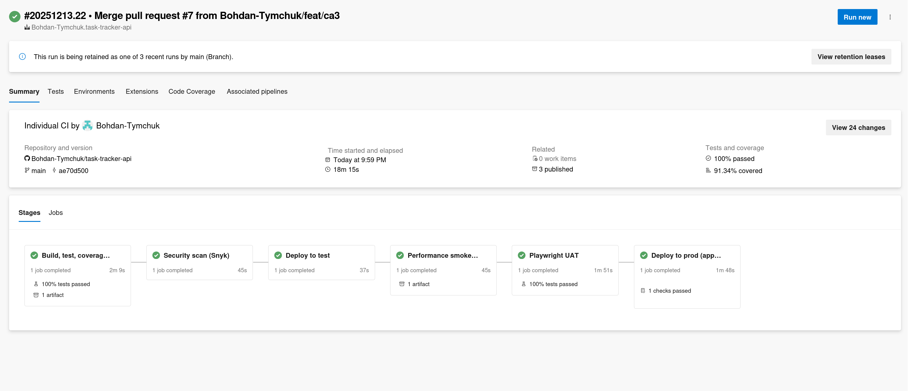

Test execution in Azure Pipelines (unit/integration + Playwright UAT):
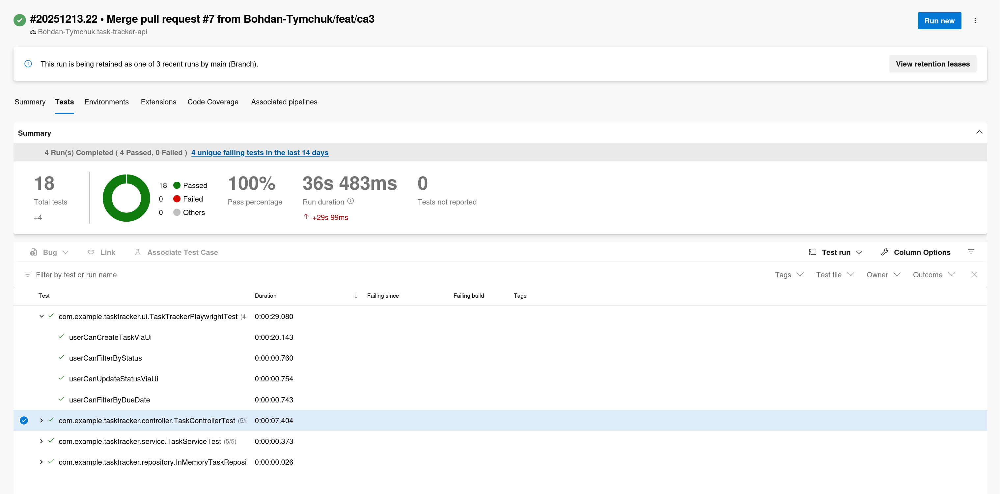

JaCoCo coverage published in pipeline:
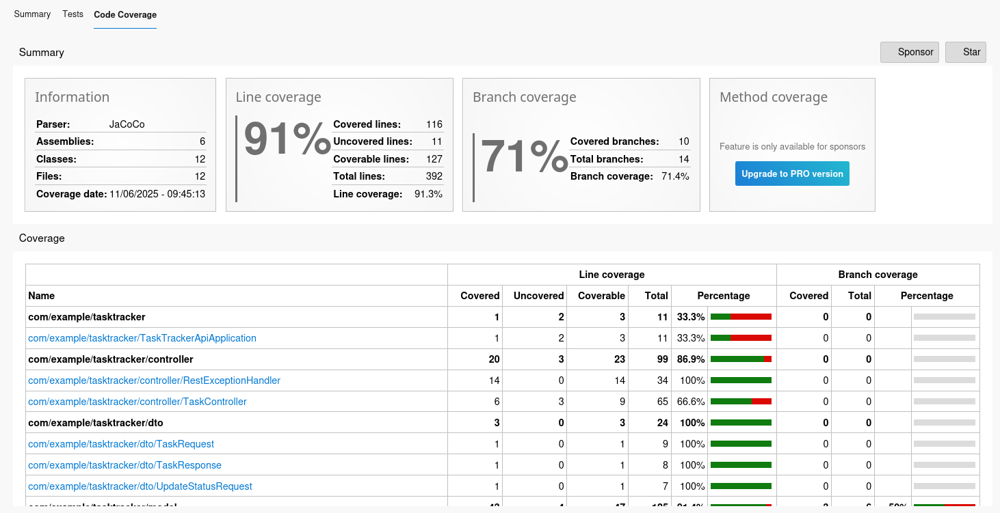

## Branch Policies and Protection
- Protected `main`; PRs required with status checks.
- Azure Pipeline as required check; block force pushes.
- Suggested flow: feature branches → PR to `main`; prod deploy only from merged `main` with approval.

GitHub branch protection rules and required status checks:
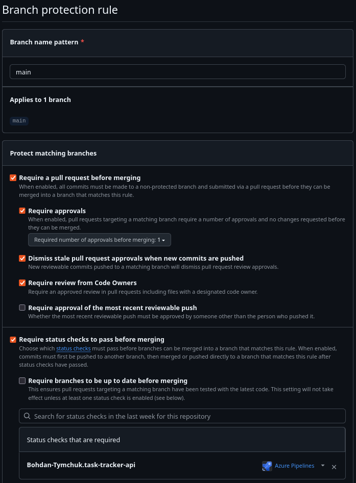

## Testing Strategy
- Unit/integration: JUnit + MockMvc, JaCoCo ≥80%.
- Static analysis: Checkstyle, SpotBugs; SonarCloud on `main`.
- Security: Snyk CLI stage (fails on issues).
- UI/UAT: Playwright (Java) headless Chromium against embedded app; seeds via API, validates UI flows.
- Performance: k6 smoke against test environment, `--out cloud` to Grafana/k6 Cloud.

## Environment Setup and Configuration
- Azure Resource Group + App Service Plan.
- Web Apps: `tasktracker-api-test` (test), `tasktracker-api` (prod).
- Service connection: `sc-tasktracker-api` (managed identity).
- Pipeline variables: app names, `testBaseUrl`, secrets `SNYK_TOKEN`, `K6_CLOUD_TOKEN`.

Azure resources (App Service plan and test/prod Web Apps):
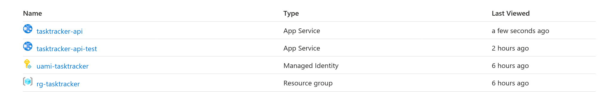

ADO environments mapped to deployments:
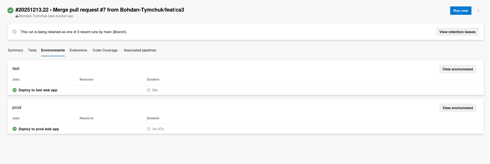

## Deployment Process
- Build artifact once; deploy same JAR to test, then prod.
- Prod stage gated to `main` and requires approval in ADO `prod` environment.
- Test URL: `https://tasktracker-api-test-gwhueuakbzhmejaw.switzerlandnorth-01.azurewebsites.net`.
- Prod URL: `https://tasktracker-api-e5akhdazhkemdngk.switzerlandnorth-01.azurewebsites.net`.

## Security and Performance Testing
- Snyk stage with `SNYK_TOKEN`; fails on findings.
- k6 smoke (`perf/smoke.js`) against test; `--out cloud` to Grafana/k6 Cloud.

Snyk dashboard showing project issues and fixes:
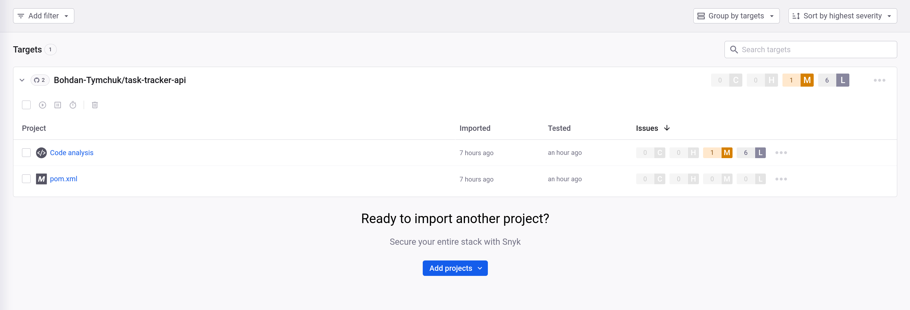

Snyk PR check passing in CI:
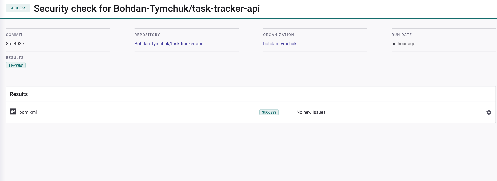

k6 dashboard in Grafana Cloud:
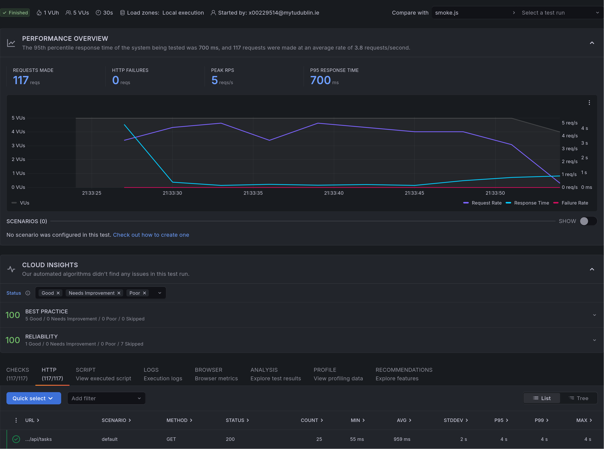

## UAT Testing (Playwright)
- Playwright (Java) headless Chromium suite seeds tasks via API, then validates UI create/filter/update flows.
- Runs after test deploy; publishes JUnit results.

Tests tab with Playwright suite passing (Playwright + unit/integration runs):
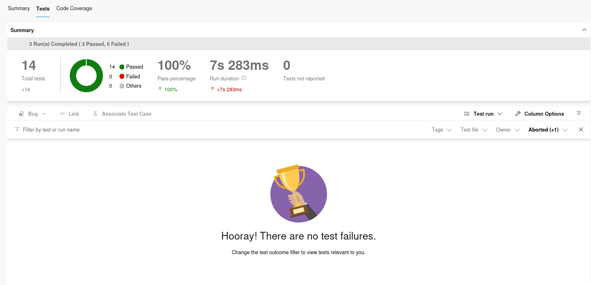

## Pipeline Approval Gates
- ADO environment `prod` requires manual approval; prod deploy runs only on `main`.
- Approval email prompts before prod deployment; rejecting keeps prod unchanged.

Approval notification for prod deployment gate:
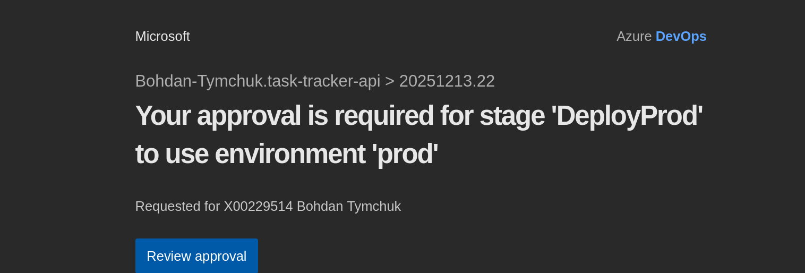

## Troubleshooting Guide
- Maven download issues: `mvn -Dmaven.repo.local=./.m2 verify`.
- Playwright deps missing: run `mvn -Dexec.classpathScope=test exec:java -Dexec.mainClass=com.microsoft.playwright.CLI -Dexec.args="install-deps chromium"` or `npx playwright install-deps chromium`.
- Pipeline missing? Ensure ADO service connection has rights to the RG/apps.
- Prod approval on PR? Not anymore: prod stage gated to `main` only.

## Notes and References
- Grafana k6 Cloud: https://grafana.com/docs/k6/
- Playwright Java: https://playwright.dev/java/docs/intro
- Snyk CLI: https://docs.snyk.io
All external configs/snippets are adapted from vendor docs (see above URLs).

